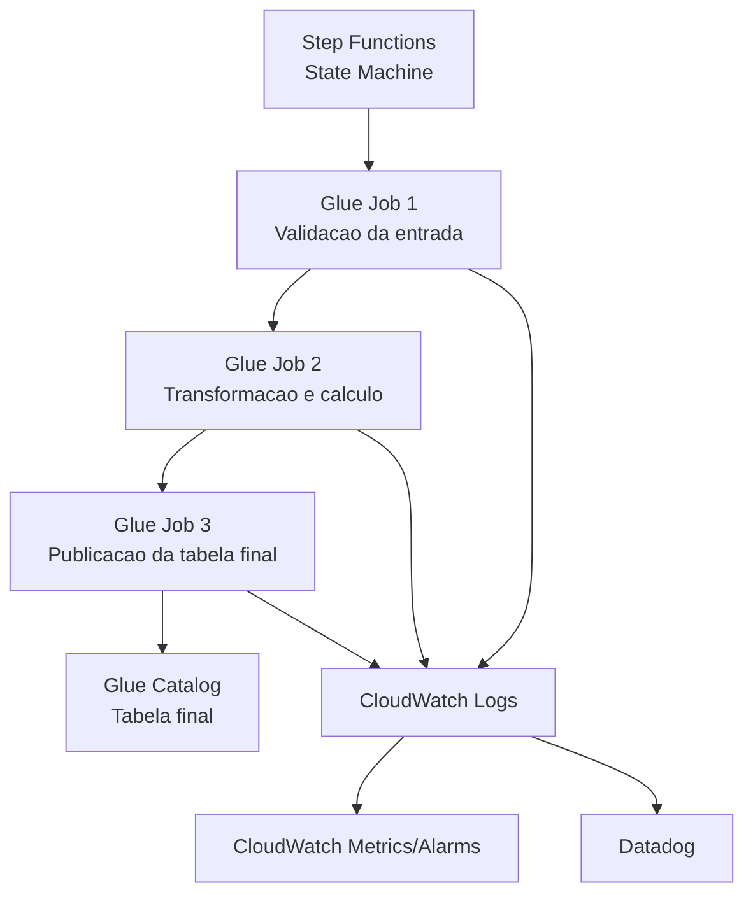

# RFC — Pipeline de Entrega de Margem Gerencial para Contratos Imobiliários

**TL:** Felipe Almeida · **PM/PO:** Mariana Costa · **Data:** 21/04/2026
**PRD de origem:** `../prd/exemplo_prd_margem.md` · **Status:** Em revisão

> Este documento descreve como a solução será implementada usando somente Step Functions,
> Glue, Glue Catalog, CloudWatch e Datadog.

---

## Problema técnico

O sistema de margem gerencial precisa consumir uma tabela padronizada com uma linha por
contrato imobiliário, contendo as chaves do contrato e 10 variáveis de valor.

Hoje essa estrutura não existe. A informação está concentrada em uma tabela de origem com
contratos imobiliários, mas não há processo padronizado de transformação, publicação e
monitoramento da saída.

---

## Decisão adotada

Implementar um pipeline batch mensal orquestrado por Step Functions, com transformação em
AWS Glue e publicação do resultado em uma nova tabela no Glue Catalog. Toda a execução
será monitorada por CloudWatch e Datadog.

---

## Escopo técnico

### Serviços permitidos nesta solução

| Serviço | Papel na solução |
|---|---|
| Step Functions | Orquestra o fluxo e trata sucesso/falha |
| AWS Glue Job | Executa leitura, transformação e escrita |
| Glue Catalog | Registra a tabela de entrada e a tabela de saída |
| CloudWatch | Centraliza logs, métricas e alarmes |
| Datadog | Consolida observabilidade operacional |

### Fora de escopo técnico

| Item | Motivo |
|---|---|
| APIs online | O consumo é batch e tabelado |
| Banco relacional dedicado para serving | A saída será uma tabela catalogada |
| Outros orquestradores | A orquestração será exclusiva em Step Functions |
| Outros serviços AWS de mensageria ou compute | Não fazem parte da solução acordada |

---

## Arquitetura proposta

### Fluxo resumido

1. A Step Function inicia o processamento do mês de referência
2. O `Glue Job 1` valida a existência da tabela de entrada, schema mínimo e volume lido
3. O `Glue Job 2` calcula as 10 variáveis de valor a partir da tabela de contratos
4. O `Glue Job 3` publica o resultado final e garante o registro da tabela no Glue Catalog
5. Logs e métricas são enviados para CloudWatch
6. O Datadog consome os sinais operacionais para acompanhamento e alerta

---

## Tabelas envolvidas

### Tabela de entrada

| Item | Valor |
|---|---|
| Nome lógico | `tb_contrato_imobiliario_origem` |
| Domínio | Crédito imobiliário |
| Granularidade | 1 linha por contrato |
| Origem esperada | Base já disponível no Glue Catalog |

### Validação da origem e dos campos

Esta RFC parte das validações já registradas no PRD. O time técnico só deve iniciar a
implementação com base nos campos aprovados para uso de negócio ou com pendências
explicitamente aceitas.

| Informação de negócio | Tabela | Campos de origem | Status de validação | Tratamento técnico |
|---|---|---|---|---|
| Chaves do contrato | `tb_contrato_imobiliario_origem` | `cd_contrato`, `cd_sistema_origem`, `nr_proposta` | Validado | Campos obrigatórios |
| Documento do cliente | `tb_contrato_imobiliario_origem` | `nr_cpf_cnpj_cliente` | Validado com pendência de mascaramento | Campo obrigatório; política definida antes do go-live |
| Datas do contrato | `tb_contrato_imobiliario_origem` | `dt_contratacao`, `dt_vencimento_final` | Validado | Usado em prazo remanescente |
| Saldo do contrato | `tb_contrato_imobiliario_origem` | `vl_saldo_devedor_atual` | Validado | Base para `vl_saldo_medio` |
| Parcela do contrato | `tb_contrato_imobiliario_origem` | `vl_parcela_atual` | Validado | Base para `vl_receita_tarifas` |
| Taxa do contrato | `tb_contrato_imobiliario_origem` | `vl_taxa_juros_aa` | Validado | Base para `vl_receita_juros` |
| Garantia do imóvel | `tb_contrato_imobiliario_origem` | `vl_garantia_imovel` | Validado | Base para `vl_ltv_atual` |
| Funding | `tb_contrato_imobiliario_origem` | `vl_custo_funding_aa` | Validado | Base para `vl_custo_funding` |
| Perda esperada | `tb_contrato_imobiliario_origem` | `pc_inadimplencia_modelo` | Validado | Base para `vl_perda_esperada` |
| Custo operacional | `tb_contrato_imobiliario_origem` | `pc_custo_operacional` | Validado | Base para `vl_custo_operacional` |

### Tabela de saída

| Item | Valor |
|---|---|
| Nome lógico | `tb_margem_gerencial_contrato_imobiliario` |
| Domínio | Margem gerencial |
| Granularidade | 1 linha por contrato por mês de referência |
| Registro no catálogo | Obrigatório |

---

## Contrato da tabela final

### Chaves

| Campo | Tipo sugerido | Observação |
|---|---|---|
| `cd_contrato` | string | Identificador principal |
| `cd_sistema_origem` | string | Origem do contrato |
| `nr_proposta` | string | Chave comercial |
| `nr_cpf_cnpj_cliente` | string | Documento do cliente |
| `dt_referencia` | date | Competência do cálculo |

### Variáveis de valor

| Campo | Tipo sugerido | Regra resumida |
|---|---|---|
| `vl_saldo_medio` | decimal(18,2) | Igual ao saldo devedor atual na V1 |
| `vl_margem_liquida` | decimal(18,2) | Resultado final do contrato |
| `vl_receita_juros` | decimal(18,2) | Saldo médio x taxa de juros mensal |
| `vl_custo_funding` | decimal(18,2) | Saldo médio x custo funding mensal |
| `vl_custo_operacional` | decimal(18,2) | Saldo médio x percentual operacional |
| `vl_perda_esperada` | decimal(18,2) | Saldo médio x percentual de inadimplência |
| `vl_receita_tarifas` | decimal(18,2) | Parcela atual x fator fixo |
| `vl_resultado_bruto` | decimal(18,2) | Receita juros + tarifas - funding |
| `vl_ltv_atual` | decimal(18,6) | Saldo / garantia |
| `vl_prazo_remanescente_meses` | int | Meses até vencimento final |

### Mapeamento de entrada para saída

| Saída | Origem principal | Observação |
|---|---|---|
| `cd_contrato` | `cd_contrato` | Cópia direta |
| `cd_sistema_origem` | `cd_sistema_origem` | Cópia direta |
| `nr_proposta` | `nr_proposta` | Cópia direta |
| `nr_cpf_cnpj_cliente` | `nr_cpf_cnpj_cliente` | Cópia direta; sujeito à política de mascaramento |
| `dt_referencia` | parâmetro de execução | Definido no início da execução |
| `vl_saldo_medio` | `vl_saldo_devedor_atual` | Derivado conforme regra da V1 |
| `vl_margem_liquida` | múltiplos campos | Derivado |
| `vl_receita_juros` | `vl_saldo_devedor_atual`, `vl_taxa_juros_aa` | Derivado |
| `vl_custo_funding` | `vl_saldo_devedor_atual`, `vl_custo_funding_aa` | Derivado |
| `vl_custo_operacional` | `vl_saldo_devedor_atual`, `pc_custo_operacional` | Derivado |
| `vl_perda_esperada` | `vl_saldo_devedor_atual`, `pc_inadimplencia_modelo` | Derivado |
| `vl_receita_tarifas` | `vl_parcela_atual` | Derivado |
| `vl_resultado_bruto` | variáveis calculadas | Derivado |
| `vl_ltv_atual` | `vl_saldo_devedor_atual`, `vl_garantia_imovel` | Derivado |
| `vl_prazo_remanescente_meses` | `dt_vencimento_final` | Derivado |

---

## Desenho da Step Function

### Estados propostos

| Estado | Tipo | Objetivo |
|---|---|---|
| `ValidarEntrada` | Task | Disparar `Glue Job 1` |
| `ChecarValidacao` | Choice | Seguir somente se a validação passar |
| `CalcularVariaveis` | Task | Disparar `Glue Job 2` |
| `ChecarCalculo` | Choice | Validar status do cálculo |
| `PublicarTabelaFinal` | Task | Disparar `Glue Job 3` |
| `Sucesso` | Succeed | Encerrar execução com status positivo |
| `Falha` | Fail | Encerrar execução com status negativo |

### Comportamento esperado

| Situação | Ação da Step Function |
|---|---|
| Job retorna sucesso | Avança para o próximo estado |
| Job retorna falha | Encerra em `Falha` |
| Schema inválido | Interrompe antes do cálculo |
| Falha na publicação | Não marca a execução como concluída |

---

## Desenho dos Glue Jobs

### Glue Job 1 — Validação da entrada

Responsabilidades:

| Verificação | Resultado esperado |
|---|---|
| Tabela existe no Glue Catalog | Execução prossegue |
| Campos mínimos obrigatórios existem | Execução prossegue |
| Tipos essenciais são compatíveis | Execução prossegue |
| Quantidade lida é maior que zero | Execução prossegue |

Saída lógica:
- status da validação
- quantidade de registros lidos
- quantidade de registros inválidos por regra estrutural

### Glue Job 2 — Cálculo das variáveis

Responsabilidades:

| Etapa | Ação |
|---|---|
| Leitura | Consumir `tb_contrato_imobiliario_origem` |
| Padronização | Tratar nulos, datas e tipos numéricos |
| Cálculo | Aplicar RN01 a RN10 do PRD |
| Qualidade | Rejeitar registros sem chave obrigatória |

Regras de implementação:
- uma linha de saída para cada contrato válido da entrada
- contratos rejeitados não entram na tabela final
- contadores de rejeição devem ser enviados para log estruturado

### Regras técnicas de cálculo

As fórmulas abaixo implementam exatamente as regras aprovadas no PRD:

| Campo de saída | Regra técnica |
|---|---|
| `vl_saldo_medio` | `vl_saldo_devedor_atual` |
| `vl_receita_juros` | `vl_saldo_medio * (vl_taxa_juros_aa / 12)` |
| `vl_custo_funding` | `vl_saldo_medio * (vl_custo_funding_aa / 12)` |
| `vl_custo_operacional` | `vl_saldo_medio * pc_custo_operacional` |
| `vl_perda_esperada` | `vl_saldo_medio * pc_inadimplencia_modelo` |
| `vl_receita_tarifas` | `vl_parcela_atual * 0.002` |
| `vl_resultado_bruto` | `vl_receita_juros + vl_receita_tarifas - vl_custo_funding` |
| `vl_ltv_atual` | `vl_saldo_devedor_atual / vl_garantia_imovel` |
| `vl_prazo_remanescente_meses` | diferença em meses entre `dt_referencia` e `dt_vencimento_final`, com piso em zero |
| `vl_margem_liquida` | `vl_resultado_bruto - vl_perda_esperada - vl_custo_operacional` |

Regras complementares:
- quando `vl_garantia_imovel <= 0`, `vl_ltv_atual` deve ser `null`
- quando `dt_vencimento_final < dt_referencia`, `vl_prazo_remanescente_meses` deve ser `0`
- registros sem chave obrigatória ou sem insumo mínimo de cálculo devem ser rejeitados

### Glue Job 3 — Publicação

Responsabilidades:

| Etapa | Ação |
|---|---|
| Escrita | Gerar a estrutura final da tabela |
| Registro | Garantir tabela disponível no Glue Catalog |
| Particionamento lógico | Publicar por `dt_referencia` |
| Reprocessamento | Substituir a partição do mês de referência |

---

## Regras de qualidade e processamento

| Regra | Tratamento |
|---|---|
| Campo previsto no PRD sem validação de negócio | Não seguir para produção sem aceite explícito |
| Chave obrigatória nula | Registro rejeitado |
| `vl_garantia_imovel <= 0` | `vl_ltv_atual = null` e log de advertência |
| `dt_vencimento_final < dt_referencia` | `vl_prazo_remanescente_meses = 0` |
| Campo numérico inválido | Registro rejeitado |
| Reprocessamento da mesma competência | Sobrescrita lógica da competência |

---

## Observabilidade

### CloudWatch

| Sinal | Uso |
|---|---|
| Logs por job | Diagnóstico detalhado por execução |
| Métrica de duração | Acompanhar SLA do pipeline |
| Métrica de volume lido | Detectar quebra de carga |
| Métrica de registros rejeitados | Detectar problema de qualidade |
| Alarme de falha | Notificar operação quando a execução falhar |

### Datadog

| Painel ou alerta | Objetivo |
|---|---|
| Execuções com sucesso x falha | Saúde geral do pipeline |
| Tempo total de execução | Controle do SLA mensal |
| Registros processados | Monitorar desvios de volume |
| Registros rejeitados | Antecipar incidente de qualidade |

---

## Estratégia de testes

| Tipo de teste | Cobertura mínima |
|---|---|
| Unitário | Cálculo das 10 variáveis |
| Integração | Execução completa dos 3 Glue Jobs |
| Contrato | Schema exato da tabela final |
| Reprocessamento | Sobrescrita correta da competência |

### Casos obrigatórios

| Caso | Resultado esperado |
|---|---|
| Contrato válido completo | Linha publicada com todas as chaves e 10 variáveis |
| Contrato com dados de origem compatíveis com o PRD | Todos os cálculos devem refletir as fórmulas aprovadas |
| Contrato sem garantia válida | `vl_ltv_atual = null` |
| Contrato vencido | Prazo remanescente zerado |
| Registro sem `cd_contrato` | Registro rejeitado |
| Registro com campo obrigatório não validado ou ausente na origem | Falha na validação ou rejeição controlada, conforme etapa |
| Reexecução do mesmo mês | Sem duplicidade lógica |

---

## Plano de implementação

### Régua de tamanhos

| Tamanho | Tempo sugerido |
|---|---|
| `PPP` | 0,5 dia útil |
| `PP` | 1 dia útil |
| `P` | 2 dias úteis |
| `M` | 3 dias úteis |
| `G` | 5 dias úteis |
| `GG` | 8 dias úteis |
| `XG` | 10 dias úteis |
| `XXG` | acima de 10 dias úteis |

### Quebra de histórias

| História | O que entrega | Depende de | Tamanho | Tempo estimado |
|---|---|---|---|---|
| H-01 | Criar a estrutura da Step Function com estados de validação, cálculo e publicação | — | M | 2 dias úteis |
| H-02 | Implementar `Glue Job 1` para validar existência da tabela, campos obrigatórios e volume de entrada | H-01 | M | 2 dias úteis |
| H-03 | Implementar `Glue Job 2` com padronização dos dados e cálculo das 10 variáveis de valor | H-02 | G | 4 dias úteis |
| H-04 | Implementar `Glue Job 3` para publicar a tabela final e registrar a saída no Glue Catalog | H-03 | M | 2 dias úteis |
| H-05 | Configurar logs, métricas e alarmes em CloudWatch e visão operacional no Datadog | H-01, H-02, H-03, H-04 | M | 2 dias úteis |
| H-06 | Executar testes de contrato, integração e reprocessamento da competência | H-02, H-03, H-04 | M | 2 dias úteis |

### Critério de pronto por história

| História | Critério para considerar pronta |
|---|---|
| H-01 | Fluxo orquestrado com estados definidos e tratamento de sucesso e falha documentado |
| H-02 | Validação bloqueia schema inválido, tabela inexistente e carga vazia |
| H-03 | Cálculos reproduzem exatamente as regras aprovadas no PRD |
| H-04 | Tabela final fica disponível para consumo com schema esperado e reprocessamento controlado |
| H-05 | Execução pode ser acompanhada por logs, métricas e alertas operacionais |
| H-06 | Evidências de teste mostram contrato correto, execução ponta a ponta e sobrescrita da competência |

### Sequência sugerida

1. Estruturar orquestração
2. Validar a entrada
3. Implementar cálculo
4. Publicar a saída
5. Fechar observabilidade
6. Executar testes finais

### Estimativa total

Total simples das histórias: **14 dias úteis**

---

## Riscos

| Risco | Impacto | Mitigação |
|---|---|---|
| Schema da origem mudar sem aviso | Alto | Validação explícita no `Glue Job 1` |
| Campo aprovado no PRD chegar com semântica diferente da validada | Alto | Bloquear promoção até reconfirmação com negócio |
| Campos financeiros chegarem nulos acima do esperado | Alto | Métrica de rejeição e bloqueio por limiar |
| Volume mensal crescer além do previsto | Médio | Ajuste de capacidade do Glue Job |
| Divergência na interpretação de `vl_saldo_medio` | Médio | Regra documentada e aprovada no PRD |

---

## Rollback

| Situação | Ação |
|---|---|
| Falha antes da publicação | Encerrar execução e manter tabela anterior |
| Falha após publicação inconsistente | Reexecutar a competência correta sobrescrevendo a partição |
| Erro de regra de cálculo identificado após entrega | Corrigir job e reprocessar a competência afetada |

---

## Decisões importantes

| Tema | Decisão |
|---|---|
| Produto coberto | Somente contrato imobiliário |
| Fonte de verdade de campos e validação | PRD aprovado pelo negócio |
| Forma de consumo | Tabela no Glue Catalog |
| Orquestração | Exclusivamente Step Functions |
| Processamento | Exclusivamente Glue |
| Monitoramento | CloudWatch e Datadog |
