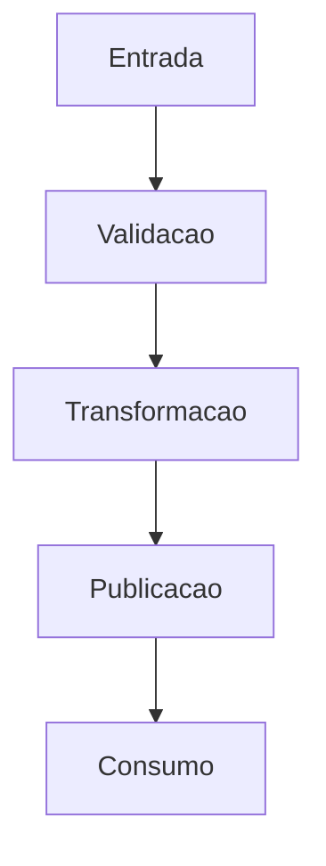

# RFC — [Nome da iniciativa]

**TL:** [Nome] · **PM/PO:** [Nome] · **Data:** [dd/mm/aaaa]
**PRD de origem:** `[arquivo_ou_link_do_prd]` · **Status:** Rascunho / Em revisão / Aprovado

> Este documento descreve como a solução será implementada a partir das regras aprovadas
> no PRD.

---

## Problema técnico

[Explique o problema do ponto de vista técnico: o que não existe hoje, o que precisa ser
construído e qual limitação técnica ou operacional precisa ser endereçada.]

---

## Decisão adotada

[Escreva em uma frase qual solução foi escolhida.]

---

## Escopo técnico

### Componentes e serviços da solução

| Serviço / componente | Papel na solução |
|---|---|
| [Componente 1] | [Papel] |
| [Componente 2] | [Papel] |
| [Componente 3] | [Papel] |

### Fora de escopo técnico

| Item | Motivo |
|---|---|
| [Fora do escopo] | [Justificativa] |
| [Fora do escopo] | [Justificativa] |
| [Fora do escopo] | [Justificativa] |

---

## Arquitetura proposta

### Fluxo resumido

1. [Passo 1]
2. [Passo 2]
3. [Passo 3]
4. [Passo 4]

---

## Tabelas envolvidas

### Tabela de entrada

| Item | Valor |
|---|---|
| Nome lógico | `[nome_da_tabela]` |
| Domínio | [Domínio] |
| Granularidade | [Granularidade] |
| Origem esperada | [Origem] |

### Validação da origem e dos campos

Esta RFC parte das validações registradas no PRD. O time técnico só deve seguir para
implementação e produção com base nos campos aprovados pelo negócio ou com pendências
explicitamente aceitas.

| Informação de negócio | Tabela | Campos de origem | Status de validação | Tratamento técnico |
|---|---|---|---|---|
| [Informação] | `[tabela]` | `[campo_1, campo_2]` | Validado | [Tratamento] |
| [Informação] | `[tabela]` | `[campo_1]` | Pendente | [Tratamento] |
| [Informação] | `[tabela]` | `[campo_1]` | Com restrição | [Tratamento] |

### Tabela de saída

| Item | Valor |
|---|---|
| Nome lógico | `[nome_da_tabela_saida]` |
| Domínio | [Domínio] |
| Granularidade | [Granularidade] |
| Registro no catálogo / destino | [Obrigatório / opcional] |

---

## Contrato da saída final

### Chaves

| Campo | Tipo sugerido | Observação |
|---|---|---|
| `[chave_1]` | [tipo] | [Observação] |
| `[chave_2]` | [tipo] | [Observação] |
| `[chave_3]` | [tipo] | [Observação] |

### Variáveis de valor

| Campo | Tipo sugerido | Regra resumida |
|---|---|---|
| `[variavel_1]` | [tipo] | [Resumo] |
| `[variavel_2]` | [tipo] | [Resumo] |
| `[variavel_3]` | [tipo] | [Resumo] |
| `[variavel_4]` | [tipo] | [Resumo] |

### Mapeamento de entrada para saída

| Saída | Origem principal | Observação |
|---|---|---|
| `[campo_saida]` | `[campo_origem]` | [Observação] |
| `[campo_saida]` | `[campo_origem]` | [Observação] |
| `[campo_saida]` | [múltiplos campos] | Derivado |

---

## Desenho do fluxo de processamento

### Etapas propostas

| Etapa | Tipo | Objetivo |
|---|---|---|
| `[Etapa 1]` | [Task / Job / Processo] | [Objetivo] |
| `[Etapa 2]` | [Task / Job / Processo] | [Objetivo] |
| `[Etapa 3]` | [Task / Job / Processo] | [Objetivo] |

### Comportamento esperado

| Situação | Ação esperada |
|---|---|
| [Sucesso] | [Comportamento] |
| [Falha] | [Comportamento] |
| [Inconsistência] | [Comportamento] |

---

## Desenho das etapas técnicas

### Etapa 1 — Validação da entrada

| Verificação | Resultado esperado |
|---|---|
| [Validação] | [Resultado] |
| [Validação] | [Resultado] |
| [Validação] | [Resultado] |

Saída lógica:
- [saída 1]
- [saída 2]
- [saída 3]

### Etapa 2 — Transformação e cálculo

| Etapa | Ação |
|---|---|
| Leitura | [Ação] |
| Padronização | [Ação] |
| Cálculo | [Ação] |
| Qualidade | [Ação] |

Regras de implementação:
- [Regra]
- [Regra]
- [Regra]

### Regras técnicas de cálculo

As fórmulas abaixo devem implementar exatamente as regras aprovadas no PRD:

| Campo de saída | Regra técnica |
|---|---|
| `[campo_calculado_1]` | `[expressão]` |
| `[campo_calculado_2]` | `[expressão]` |
| `[campo_calculado_3]` | `[expressão]` |

Regras complementares:
- [Regra complementar]
- [Regra complementar]
- [Regra complementar]

### Etapa 3 — Publicação

| Etapa | Ação |
|---|---|
| Escrita | [Ação] |
| Registro | [Ação] |
| Particionamento / organização | [Ação] |
| Reprocessamento | [Ação] |

---

## Regras de qualidade e processamento

| Regra | Tratamento |
|---|---|
| Campo previsto no PRD sem validação de negócio | Não seguir para produção sem aceite explícito |
| [Regra de qualidade] | [Tratamento] |
| [Regra de qualidade] | [Tratamento] |
| [Regra de qualidade] | [Tratamento] |

---

## Observabilidade

### Logs e métricas operacionais

| Sinal | Uso |
|---|---|
| [Log ou métrica] | [Uso] |
| [Log ou métrica] | [Uso] |
| [Log ou métrica] | [Uso] |
| [Log ou métrica] | [Uso] |

### Alertas e painéis

| Painel ou alerta | Objetivo |
|---|---|
| [Painel ou alerta] | [Objetivo] |
| [Painel ou alerta] | [Objetivo] |
| [Painel ou alerta] | [Objetivo] |

---

## Estratégia de testes

| Tipo de teste | Cobertura mínima |
|---|---|
| Unitário | [Escopo] |
| Integração | [Escopo] |
| Contrato | [Escopo] |
| Reprocessamento | [Escopo] |

### Casos obrigatórios

| Caso | Resultado esperado |
|---|---|
| [Caso principal] | [Resultado] |
| [Caso de cálculo] | [Resultado] |
| [Caso de exceção] | [Resultado] |
| [Reexecução] | [Resultado] |

---

## Plano de implementação

### Régua de tamanhos

| Tamanho | Tempo sugerido |
|---|---|
| `PPP` | 0,5 dia útil |
| `PP` | 1 dia útil |
| `P` | 2 dias úteis |
| `M` | 3 dias úteis |
| `G` | 5 dias úteis |
| `GG` | 8 dias úteis |
| `XG` | 10 dias úteis |
| `XXG` | acima de 10 dias úteis |

### Quebra de histórias

| História | O que entrega | Depende de | Tamanho | Tempo estimado |
|---|---|---|---|---|
| H-01 | [Entrega da primeira história] | — | P / M / G | [x dias úteis] |
| H-02 | [Entrega da segunda história] | H-01 | P / M / G | [x dias úteis] |
| H-03 | [Entrega da terceira história] | H-01 / H-02 | P / M / G | [x dias úteis] |
| H-04 | [Entrega da quarta história] | [Dependência] | P / M / G | [x dias úteis] |

### Critério de pronto por história

| História | Critério para considerar pronta |
|---|---|
| H-01 | [Critério objetivo] |
| H-02 | [Critério objetivo] |
| H-03 | [Critério objetivo] |
| H-04 | [Critério objetivo] |

### Sequência sugerida

1. [Passo de implementação 1]
2. [Passo de implementação 2]
3. [Passo de implementação 3]
4. [Passo de implementação 4]

### Estimativa total

Total simples das histórias: **[x dias úteis]**

Observação para o autor:
- a quebra de histórias deve refletir como o time realmente pretende executar a entrega
- prefira histórias com valor técnico verificável e dependências explícitas
- se houver caminho crítico, ele deve ficar visível nesta seção
- o tempo estimado por história deve ser informado para dar visibilidade de esforço total

---

## Riscos

| Risco | Impacto | Mitigação |
|---|---|---|
| [Risco] | Alto | [Mitigação] |
| [Risco] | Médio | [Mitigação] |
| [Risco] | Baixo | [Mitigação] |

---

## Rollback

| Situação | Ação |
|---|---|
| [Falha antes da publicação] | [Ação] |
| [Falha após publicação] | [Ação] |
| [Erro de regra] | [Ação] |

---

## Decisões importantes

| Tema | Decisão |
|---|---|
| Produto coberto | [Decisão] |
| Fonte de verdade de campos e validação | PRD aprovado pelo negócio |
| Forma de consumo | [Decisão] |
| Orquestração | [Decisão] |
| Processamento | [Decisão] |
| Monitoramento | [Decisão] |
