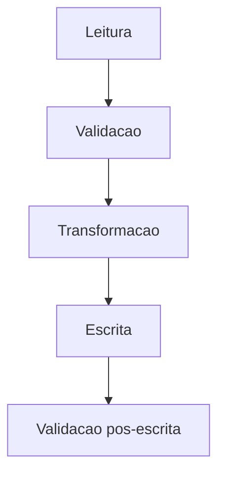

# TDD — [Nome da iniciativa / história]

**TL / Tech Lead:** [Nome] · **Responsável técnico:** [Nome] · **Data:** [dd/mm/aaaa]
**PRD de origem:** `[arquivo_ou_link_do_prd]` · **RFC de origem:** `[arquivo_ou_link_da_rfc]` · **Status:** Rascunho / Em revisão / Aprovado

> Este documento detalha como a implementação deve ser executada, testada e publicada a
> partir das decisões já aprovadas em negócio e arquitetura.

---

## Em uma frase

[Descreva em uma frase o que será implementado.]

---

## Contexto técnico da implementação

[Explique o recorte técnico desta entrega: qual parte da solução será construída agora, qual
limitação atual será resolvida e qual comportamento precisa existir ao final.]

Na prática, esta implementação precisa garantir:

1. [Garantia técnica 1]
2. [Garantia técnica 2]
3. [Garantia técnica 3]

---

## Objetivo da implementação

[Descreva o objetivo principal do ponto de vista técnico.]

Esta entrega deve produzir:

- [Resultado técnico 1]
- [Resultado técnico 2]
- [Resultado técnico 3]

Não deve incluir nesta etapa:

- [Fora do escopo 1]
- [Fora do escopo 2]

---

## Referências obrigatórias

| Artefato | Referência | Observação |
|---|---|---|
| PRD | `[link_ou_arquivo]` | [Versão utilizada] |
| RFC | `[link_ou_arquivo]` | [Versão utilizada] |
| História / task | `[link_ou_id]` | [Observação] |
| Fonte adicional | `[link_ou_arquivo]` | [Observação] |

---

## Escopo técnico detalhado

### Componentes que serão alterados

| Componente | Tipo | Papel nesta entrega |
|---|---|---|
| [Componente 1] | [job / dataset / API / serviço / DAG] | [Papel] |
| [Componente 2] | [job / dataset / API / serviço / DAG] | [Papel] |
| [Componente 3] | [job / dataset / API / serviço / DAG] | [Papel] |

### Fora do escopo desta implementação

| Item | Motivo |
|---|---|
| [Item] | [Justificativa] |
| [Item] | [Justificativa] |
| [Item] | [Justificativa] |

---

## Pré-condições e dependências

| Tema | Necessidade | Status |
|---|---|---|
| [Dependência de negócio] | [Necessidade] | [Aberto / Validado / Bloqueado] |
| [Dependência técnica] | [Necessidade] | [Aberto / Validado / Bloqueado] |
| [Acesso / permissão / catálogo] | [Necessidade] | [Aberto / Validado / Bloqueado] |

Premissas assumidas:

- [Premissa 1]
- [Premissa 2]
- [Premissa 3]

---

## Contrato de entrada

### Origem principal

| Item | Valor |
|---|---|
| Tabela / sistema | `[nome_da_origem]` |
| Granularidade | [Granularidade] |
| Janela de processamento | [Janela] |
| Chave de leitura | `[chave]` |

### Campos consumidos

| Campo de origem | Tipo | Obrigatório | Uso na implementação |
|---|---|---|---|
| `[campo_1]` | [tipo] | Sim | [Uso] |
| `[campo_2]` | [tipo] | Sim | [Uso] |
| `[campo_3]` | [tipo] | Não | [Uso] |
| `[campo_4]` | [tipo] | Não | [Uso] |

### Regras de leitura

| Regra | Tratamento esperado |
|---|---|
| [Registro ausente] | [Tratamento] |
| [Campo nulo] | [Tratamento] |
| [Duplicidade] | [Tratamento] |
| [Janela fora do esperado] | [Tratamento] |

---

## Contrato de saída

### Destino principal

| Item | Valor |
|---|---|
| Tabela / sistema de saída | `[nome_do_destino]` |
| Granularidade | [Granularidade] |
| Chaves da saída | `[chave_1, chave_2]` |
| Estratégia de escrita | [append / merge / overwrite particionado] |

### Campos entregues

| Campo de saída | Tipo | Origem / regra | Observação |
|---|---|---|---|
| `[campo_saida_1]` | [tipo] | `[campo_origem]` | [Observação] |
| `[campo_saida_2]` | [tipo] | `[regra]` | [Observação] |
| `[campo_saida_3]` | [tipo] | `[regra]` | [Observação] |
| `[campo_saida_4]` | [tipo] | `[campo_origem]` | [Observação] |

---

## Regras de implementação

### Regra 1 — Validação inicial

[Descreva a primeira validação obrigatória.]

### Regra 2 — Padronização

[Descreva como valores devem ser normalizados.]

### Regra 3 — Derivação de campos

`[campo_derivado] = [expressão ou lógica resumida]`

[Explique a lógica e a exceção relevante.]

### Regra 4 — Tratamento de exceções

[Explique como tratar nulo, zero, vencido, inválido ou ausente.]

### Regra 5 — Idempotência / reprocessamento

[Explique como evitar duplicidade, perda ou inconsistência em reexecuções.]

---

## Desenho do fluxo técnico

### Sequência de processamento

1. [Passo 1]
2. [Passo 2]
3. [Passo 3]
4. [Passo 4]
5. [Passo 5]

### Etapas detalhadas

| Etapa | Entrada | Processamento | Saída |
|---|---|---|---|
| [Etapa 1] | [Entrada] | [Processamento] | [Saída] |
| [Etapa 2] | [Entrada] | [Processamento] | [Saída] |
| [Etapa 3] | [Entrada] | [Processamento] | [Saída] |

---

## Estratégia de desenvolvimento

### Estrutura sugerida

| Item | Descrição |
|---|---|
| Arquivo / módulo principal | `[caminho_ou_nome]` |
| Funções ou etapas principais | `[nomes]` |
| Configurações necessárias | `[configs]` |
| Reuso esperado | `[componente existente ou utilitário]` |

### Decisões de implementação

| Decisão | Motivo |
|---|---|
| [Decisão] | [Motivo] |
| [Decisão] | [Motivo] |
| [Decisão] | [Motivo] |

---

## Estratégia de testes

| Tipo de teste | O que validar | Cobertura mínima |
|---|---|---|
| Unitário | [Funções e regras] | [Escopo] |
| Integração | [Leitura / escrita / fluxo] | [Escopo] |
| Contrato | [Schema / colunas / tipos] | [Escopo] |
| Reprocessamento | [Idempotência] | [Escopo] |

### Casos obrigatórios

| Caso | Entrada resumida | Resultado esperado |
|---|---|---|
| [Caso principal] | [Entrada] | [Resultado] |
| [Campo derivado] | [Entrada] | [Resultado] |
| [Exceção] | [Entrada] | [Resultado] |
| [Registro inválido] | [Entrada] | [Resultado] |
| [Reexecução] | [Entrada] | [Resultado] |

---

## Observabilidade e operação

### Logs e métricas

| Sinal | Objetivo |
|---|---|
| [Log / métrica] | [Objetivo] |
| [Log / métrica] | [Objetivo] |
| [Log / métrica] | [Objetivo] |

### Critérios de monitoração

| Situação | Ação esperada |
|---|---|
| [Falha de leitura] | [Ação] |
| [Falha de escrita] | [Ação] |
| [Volume fora do padrão] | [Ação] |
| [Qualidade reprovada] | [Ação] |

---

## Plano de rollout

| Etapa | Descrição | Responsável |
|---|---|---|
| Desenvolvimento | [Descrição] | [Nome ou papel] |
| Homologação | [Descrição] | [Nome ou papel] |
| Publicação | [Descrição] | [Nome ou papel] |
| Acompanhamento inicial | [Descrição] | [Nome ou papel] |

### Estratégia de rollback

[Descreva como interromper ou reverter a entrega em caso de falha.]

---

## Critérios de pronto

Considere esta implementação pronta quando:

- [Critério 1]
- [Critério 2]
- [Critério 3]
- [Critério 4]

---

## Riscos e pontos de atenção

| Risco | Impacto | Mitigação |
|---|---|---|
| [Risco] | [Impacto] | [Mitigação] |
| [Risco] | [Impacto] | [Mitigação] |
| [Risco] | [Impacto] | [Mitigação] |
