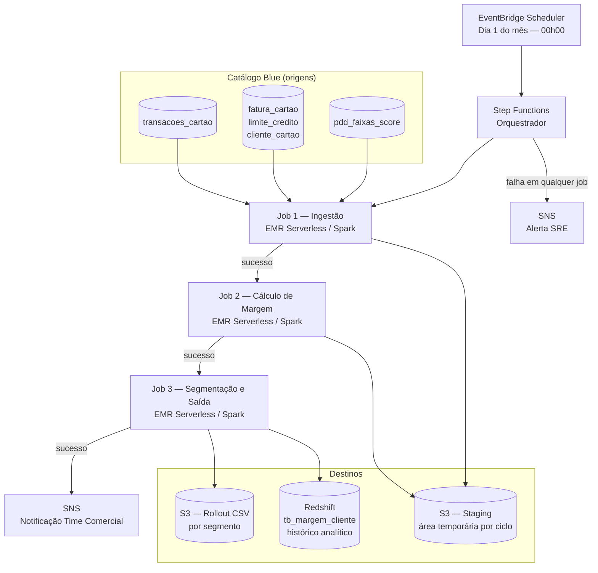

# TDD — Pipeline de Margem de Rentabilidade — Cartão Alfa

| Campo | Valor |
|---|---|
| **Tech Lead** | Bruno Ferreira |
| **PM/PO** | Ana Beatriz Torres |
| **Time** | Carla Dias (Eng. Dados), Paulo Vasconcelos (SRE), Rafael Gomes (Risco), Camila Neves (Finanças) |
| **PRD de origem** | prd_cartao_margem.md |
| **Epic/Ticket** | [Link a definir] |
| **Status** | Em Review |
| **Criado em** | 21/04/2026 |
| **Atualizado em** | 21/04/2026 |

---

## 1. Contexto

O Cartão Alfa é um produto de crédito da Squad Cartões. A elegibilidade para oferta é decidida hoje com base em dois critérios simples: score de crédito ≥ 500 e renda declarada ≥ R$ 1.500. Não existe nenhum cálculo de rentabilidade associado à decisão de oferta.

O banco não possui uma camada analítica com dados de margem por cliente, nem um histórico consolidado de receitas e custos por portador do Cartão Alfa. O resultado disso é que 23% da base ativa gera margem negativa — o banco está perdendo dinheiro com esses clientes sem saber.

Este TDD descreve a arquitetura e as decisões técnicas do pipeline batch mensal que calculará a margem líquida de cada cliente e gerará os insumos para o rollout segmentado por rentabilidade do Cartão Alfa.

**Partes interessadas:**
- **Ana Beatriz Torres (PO):** define as regras de negócio e os critérios de rollout
- **Rafael Gomes (Risco de Crédito):** valida as faixas de PDD e a taxa de juros do rotativo
- **Camila Neves (Finanças):** valida o custo operacional e as faixas de segmentação
- **Time Comercial:** consumidor final da lista de rollout gerada pelo pipeline
- **Paulo Vasconcelos (SRE):** infraestrutura, observabilidade e on-call

---

## 2. Definição do Problema

### Problemas a resolver

- **Oferta sem critério de rentabilidade:** o banco oferta o Cartão Alfa sem saber se aquele cliente gerará margem positiva. Resultado atual: 23% da base ativa tem margem negativa, deteriorando o resultado do produto.
- **Sem dados consolidados de rentabilidade:** não existe camada analítica com margem histórica por cliente. Decisões de campanha e rollout são tomadas com base em score e renda, sem visão de resultado financeiro do produto.
- **Rollout uniforme:** sem segmentação por rentabilidade, o rollout não prioriza os clientes de maior retorno, reduzindo o resultado das campanhas comerciais.

### Por que agora?

- A squad tem campanha comercial agendada para **02/06/2026** — a lista de elegíveis precisa estar pronta até **26/05/2026**.
- A área de Finanças identificou que a margem média do produto está em queda nos últimos 6 meses e quer corrigir a composição da base com o próximo rollout.

### Impacto de não resolver

- **Negócio:** campanha de rollout sem filtro de rentabilidade → risco de ampliar a base de clientes com margem negativa.
- **Produto:** sem dados de margem, o time não consegue avaliar a saúde do portfólio mês a mês nem embasar decisões de precificação.

---

## 3. Escopo

### ✅ Dentro do escopo (V1)

- Calcular a margem líquida mensal de cada cliente da base ativa do Cartão Alfa
- Aplicar as 5 regras de negócio (RN01 a RN05) definidas no PRD
- Classificar cada cliente em um dos três grupos: **Alta Margem**, **Margem Média** ou **Margem Baixa**
- Gerar arquivo de rollout com os clientes de Alta Margem e Margem Média para o time comercial
- Persistir o histórico mensal dos cálculos no banco analítico (auditoria e acompanhamento mês a mês)
- Permitir ajuste de parâmetros de negócio (custo operacional, faixas de segmentação, taxa de juros) sem necessidade de redeploy
- Notificar o time comercial ao fim de cada ciclo mensal

### ❌ Fora do escopo (V1)

- Calcular margem de clientes sem histórico de cartão (sem dados de gastos)
- Expor resultados via API REST (pipeline exclusivamente batch — escopo futuro)
- Integração direta com o motor de ofertas (o arquivo de rollout será entregue ao time comercial)
- Geração de relatório gerencial ou dashboard (escopo de analytics/BI)
- Suporte a outros produtos de crédito além do Cartão Alfa

### 🔮 Considerações futuras (V2+)

- API de consulta de margem por cliente para consumo em tempo real pelo motor de ofertas
- Extensão do modelo de cálculo para outros produtos da carteira de crédito
- Dashboard analítico com evolução de margem e distribuição de segmentos

---

## 4. Solução Técnica

### Visão geral da arquitetura

Pipeline batch mensal orquestrado por AWS Step Functions com 3 jobs Spark (EMR Serverless). O fluxo é exclusivamente orientado a arquivo e banco analítico — sem exposição via API.



### Componentes principais

| Componente | Responsabilidade |
|---|---|
| **EventBridge Scheduler** | Dispara o pipeline no dia 1 de cada mês às 00h00 |
| **Step Functions** | Orquestração sequencial dos 3 jobs; gerencia falhas e notificações |
| **Job 1 — Ingestão** | Lê as 5 tabelas do catálogo Blue, agrega dados por cliente e persiste na staging area (S3) |
| **Job 2 — Cálculo** | Lê da staging, aplica RN01 a RN04 e calcula a margem líquida por cliente |
| **Job 3 — Segmentação** | Aplica RN05 (classificação), persiste histórico no Redshift e gera CSV de rollout no S3 |
| **S3 — Staging** | Área temporária entre jobs; particionada por ano/mês; não é camada de entrega final |
| **S3 — Rollout** | Arquivo CSV por segmento consumido pelo time comercial |
| **Redshift** | Histórico analítico de margem por cliente — auditoria e consulta mês a mês |
| **SNS** | Notificação ao time comercial (sucesso) e ao SRE (falha) |
| **CloudWatch** | Métricas, logs estruturados e alarmes do pipeline |

### Fluxo de dados

1. **EventBridge** dispara a Step Function no dia 1 às 00h00
2. **Job 1** lê as 5 tabelas do catálogo Blue (transações dos últimos 12 meses, fatura, limite, score, faixas de PDD) e persiste dados agregados por cliente na staging (S3)
3. **Job 2** lê a staging, aplica as regras de negócio RN01 a RN04 e calcula a margem líquida de cada cliente; persiste o resultado na staging
4. **Job 3** lê o resultado calculado, classifica cada cliente no segmento (Alta Margem / Margem Média / Margem Baixa), persiste o histórico no Redshift e gera os arquivos CSV de rollout por segmento no S3
5. **Step Functions** dispara SNS notificando o time comercial com o caminho do arquivo
6. Em qualquer falha, **Step Functions** interrompe o fluxo no job com erro e dispara SNS de alerta para o SRE

### Parâmetros de negócio externalizados (sem redeploy)

Os parâmetros mutáveis de negócio são externalizados num arquivo JSON em S3. Qualquer ajuste (ex: custo operacional atualizado por Finanças) é feito atualizando esse arquivo, sem necessidade de deploy ou alteração de código.

```json
{
  "vl_custo_operacional": 9.20,
  "vl_limite_alta_margem": 60.0,
  "vl_limite_margem_media": 20.0,
  "taxa_juros_rotativo": 0.125
}
```

### Schema do banco analítico (Redshift)

**Tabela:** `tb_margem_cliente`

| Campo | Tipo | Descrição |
|---|---|---|
| `nr_cpf` | VARCHAR(11) | Identificador do cliente (parte da chave primária) |
| `dt_calculo` | DATE | Mês de referência do cálculo (parte da chave primária) |
| `cd_segmento_margem` | VARCHAR(10) | `PREMIUM` (Alta Margem) / `PADRAO` (Margem Média) / `RISCO` (Margem Baixa) |
| `vl_margem_projetada` | NUMERIC(12,2) | Margem líquida calculada |
| `vl_receita_total` | NUMERIC(12,2) | Soma das receitas (RN01 + RN02) |
| `vl_custo_total` | NUMERIC(12,2) | Soma dos custos (RN03 + RN04) |
| `vl_receita_intercambio` | NUMERIC(12,2) | Receita de intercâmbio — RN01 |
| `vl_receita_juros` | NUMERIC(12,2) | Receita de juros do rotativo — RN02 |
| `vl_custo_pdd` | NUMERIC(12,2) | Custo de inadimplência — RN03 |
| `vl_custo_operacional` | NUMERIC(12,2) | Custo operacional fixo — RN04 |
| `dt_processamento` | TIMESTAMP | Timestamp de inserção (auditoria) |

**Chave primária:** `(nr_cpf, dt_calculo)`
**Distribuição:** `DISTKEY(nr_cpf)` | **Ordenação:** `SORTKEY(dt_calculo)`
**Estratégia de escrita:** `append` — cada ciclo mensal gera novos registros; nenhum registro anterior é sobrescrito.

### Regras de negócio — resumo técnico

| Regra | Tabelas de insumo | Cálculo |
|---|---|---|
| **RN01 — Receita de intercâmbio** | `transacoes_cartao` (`vl_mdr`, `cd_tipo_transacao`, `dt_transacao`) | Soma de MDR por mês → média dos últimos 12 meses; somente tipo "COMPRA" |
| **RN02 — Receita de juros** | `fatura_cartao` (`vl_saldo_devedor`, `dt_referencia`) | Média do saldo devedor dos últimos 12 meses × 12,5%; zero se cliente sem rotativo |
| **RN03 — Custo de inadimplência** | `cliente_cartao` (`nr_score_credito`), `limite_credito` (`vl_limite_aprovado`), `pdd_faixas_score` (`score_min`, `score_max`, `pc_pdd`) | Join por faixa de score → `vl_limite_aprovado × pc_pdd` |
| **RN04 — Custo operacional** | Parâmetro externo (arquivo JSON em S3) | Constante R$ 9,20 por cliente |
| **RN05 — Margem líquida e segmento** | Resultado de RN01 a RN04 | `(RN01 + RN02) − (RN03 + RN04)` → classificação por faixa |

**Exclusão:** clientes com `nr_score_credito < 500` não entram no cálculo e não constam no arquivo de rollout.

**Segmentação (RN05):**

| Margem calculada | Segmento (negócio) | Código interno | Rollout |
|---|---|---|---|
| ≥ R$ 60,00 | Alta Margem | `PREMIUM` | Sim — Fase 1 |
| R$ 20,00 a R$ 59,99 | Margem Média | `PADRAO` | Sim — Fase 2 |
| < R$ 20,00 | Margem Baixa | `RISCO` | Não entra nas fases 1 e 2 |

---

## 5. Riscos

| Risco | Impacto | Probabilidade | Mitigação |
|---|---|---|---|
| JDBC para Core Banking (Oracle legado) lento com ~480k clientes | Alto | Médio | Particionar leitura por faixa de CPF (`numPartitions`); avaliar view materializada com Core Banking |
| `fatura_cartao` sem histórico de 12 meses (pendência em aberto) | Alto | Médio | Confirmar com Core Banking até 25/04; se indisponível, reduzir janela ou usar saldo mais recente como proxy |
| `vl_mdr` indisponível para parte dos clientes (pendência em aberto) | Médio | Médio | Confirmar com Carla Dias até 25/04; clientes sem `vl_mdr` terão RN01 = 0 ou serão sinalizados |
| `pdd_faixas_score` desatualizada no dia 1 do ciclo | Médio | Baixo | Verificar `dt_vigencia` no Job 1; falhar com alerta se dado tiver mais de 2 dias |
| Pipeline falha no Job 3 após Jobs 1 e 2 bem-sucedidos | Baixo | Baixo | Jobs 1 e 2 são idempotentes; Step Functions permite reprocessar apenas o Job 3 |
| Distribuição de segmentos fora do intervalo esperado (< 5% ou > 70% em Alta Margem) | Médio | Baixo | Alarme automático no CloudWatch; alerta para PO e Risco para investigação antes de acionar o rollout |

---

## 6. Plano de Implementação

| Fase | História | Descrição | Dependência | Estimativa |
|---|---|---|---|---|
| **Fase 1 — Ingestão** | H-01 | Job 1 Spark: lê as 5 tabelas do catálogo Blue e persiste na staging S3 | — | 4 dias |
| **Fase 2 — Cálculo** | H-02 | Job 2 Spark: aplica RN01 a RN04 e calcula margem por cliente | H-01 | 4 dias |
| **Fase 3 — Saída** | H-03 | Job 3 Spark: RN05, segmentação, escrita no Redshift e CSV no S3 | H-02 | 3 dias |
| **Fase 4 — Orquestração** | H-04 | Step Functions + arquivo de parâmetros S3 + notificação SNS | H-01, H-02, H-03 | 3 dias |
| **Fase 5 — Observabilidade** | H-05 | CloudWatch: métricas, logs estruturados e alarmes | H-04 | 3 dias |
| **Transversal** | — | Testes unitários e integração por job; validação em homologação | — | 4 dias |
| **Deploy** | — | Staging → shadow mode (1 ciclo) → produção | H-05 | 3 dias |

**Estimativa total:** ~24 dias úteis (~5 semanas)

**Marco crítico:** lista de rollout disponível até **26/05/2026** para campanha de **02/06/2026**

---

## 7. Considerações de Segurança

**Dado sensível:** CPF — dado pessoal nos termos da LGPD (Lei 13.709/2018)

### Proteção de dados

| Contexto | Medida |
|---|---|
| CPF em logs de execução | Sempre mascarado (`xxx*****xx`) — nenhum log registra CPF completo |
| CPF no arquivo de rollout (S3) | Mascarado antes de gravar no CSV de saída para o time comercial |
| CPF no Redshift (`tb_margem_cliente`) | Armazenado completo apenas na tabela analítica, com acesso restrito por IAM Role |
| CPF em trânsito entre componentes | Trafega exclusivamente em redes privadas AWS — sem exposição pública |

### Controle de acesso

- Jobs EMR assumem IAM Role com permissão mínima: leitura nas tabelas do catálogo Blue, leitura/escrita no bucket `cartao-margem/`, escrita na tabela `tb_margem_cliente` no Redshift
- Credenciais de JDBC e endpoints de banco armazenados no **AWS Secrets Manager** — nunca em código ou variável de ambiente em texto plano
- Bucket S3 de rollout com acesso restrito ao time comercial via bucket policy — sem acesso público

### Conformidade

- **LGPD:** CPF é dado pessoal; base legal: execução de contrato (cliente correntista); mascaramento obrigatório em todos os outputs de acesso amplo
- **Auditoria:** cada execução registra contagem de clientes processados, excluídos e segmentados — rastreável no CloudWatch Logs

---

## 8. Estratégia de Testes

| Tipo de Teste | Escopo | Critério de Aprovação |
|---|---|---|
| **Unitário** | Cada regra de negócio (RN01 a RN05) isolada | Cobertura ≥ 80% das funções de cálculo; todos os casos de borda do PRD cobertos |
| **Integração** | Cada job Spark end-to-end com dados de homologação | Saída com todos os campos esperados; zero registros corrompidos ou duplicados |
| **Validação de regra** | Casos de borda: sem MDR, score < 500, saldo devedor zero, boundaries de segmento | Comportamento alinhado com os critérios de aceite do PRD |
| **Shadow mode** | Pipeline em paralelo ao fluxo atual por 1 ciclo completo | Distribuição de segmentos validada com Risco e Finanças antes do go-live |
| **Performance** | Pipeline completo com volume real (~480k clientes) | Finalização em < 4 horas (janela operacional: 00h–06h do dia 1) |

### Cenários críticos de teste

- Cliente com score < 500 → excluído do cálculo e ausente no arquivo de rollout
- Cliente sem nenhuma compra nos últimos 12 meses (MDR = 0) → RN01 = 0; pipeline não falha
- Cliente sem saldo devedor em nenhuma fatura → RN02 = 0; pipeline não falha
- `pdd_faixas_score` com `dt_vigencia` desatualizada → Job 1 falha com alerta SNS; pipeline não prossegue
- Margem exatamente R$ 60,00 → Alta Margem (verificar boundary inclusivo)
- Margem exatamente R$ 20,00 → Margem Média (verificar boundary inclusivo)
- Parâmetro `vl_custo_operacional` alterado no arquivo JSON → novo valor aplicado sem redeploy

---

## 9. Monitoramento e Observabilidade

### Métricas (CloudWatch)

| Métrica | Limiar de Alerta | Ação |
|---|---|---|
| Duração total do pipeline | > 4 horas | PagerDuty P1 — investigação imediata |
| Contagem de clientes por segmento (Alta Margem) | < 5% ou > 70% do total | Alerta para PO + Risco — possível erro de dado ou regra |
| Clientes excluídos por score < 500 | Variação > 20% vs. mês anterior | Alerta para Risco |
| Falha em qualquer job | Qualquer ocorrência | SNS → SRE imediato |
| `dt_vigencia` de `pdd_faixas_score` | > 2 dias antes do início | Alerta preventivo e interrupção do pipeline |
| Pipeline não concluído até 06h do dia 1 | Não conclusão | PagerDuty P1 |

### Logs estruturados

Todos os logs gerados pelos jobs seguem formato JSON para ingestão no CloudWatch Logs Insights:

```json
{
  "level": "info",
  "timestamp": "2026-05-01T02:15:43Z",
  "job": "job1_ingestao",
  "mensagem": "Ingestão concluída",
  "contexto": {
    "ciclo": "2026-05",
    "clientes_lidos": 481230,
    "clientes_excluidos_score": 14870,
    "duracao_segundos": 1240
  }
}
```

**O que registrar:** início e fim de cada job com contagem de registros; falhas de leitura com identificação da tabela de origem; exclusões por regra de negócio
**O que não registrar:** CPF completo; credenciais; dados de negócio não relacionados ao pipeline

### Alertas de negócio

- **P1:** pipeline não concluído até 06h → PagerDuty imediato
- **P2:** distribuição de segmentos fora do intervalo esperado → Slack #squad-cartoes + alerta PO e Risco
- **P2:** `pdd_faixas_score` desatualizada → Slack #squad-cartoes + interrupção preventiva

---

## 10. Plano de Rollback

### Estratégia de implantação faseada

- **Fase 1 — Shadow mode:** rodar o pipeline por 1 ciclo completo em paralelo ao fluxo atual, sem impactar nenhuma oferta. Validar distribuição de segmentos com Risco e Finanças.
- **Fase 2 — Alta Margem:** habilitar uso do segmento Alta Margem no motor de ofertas via configuração externa — sem deploy.
- **Fase 3 — Margem Média:** habilitar após validação da Fase 2.

### Gatilhos para rollback

| Gatilho | Ação |
|---|---|
| Taxa de erro nas ofertas > 5% após ativação | Desabilitar segmento no motor de ofertas — imediato |
| Distribuição de segmentos inconsistente vs. shadow mode | Não prosseguir para próxima fase; investigar antes |
| Falha na criação/migração do schema no Redshift | Parar — não prosseguir; investigar e restaurar backup |
| Dados de CPF expostos sem mascaramento em log ou arquivo | Rollback imediato + acionamento do time de InfoSec |

### Passos de rollback

1. Desabilitar uso do segmento no motor de ofertas (configuração externa — sem deploy)
2. O comportamento volta ao critério anterior (score + renda)
3. Os dados no Redshift e nos arquivos S3 são preservados para auditoria — nada é deletado
4. Notificar `#squad-cartoes`, PO e SRE
5. Post-mortem em até 24h

---

## 11. Métricas de Sucesso

| Métrica | Baseline | Meta | Janela de medição |
|---|---|---|---|
| Margem líquida média por cartão ativo | R$ 18,40 | R$ 21,70 | 90 dias após go-live Fase 1 |
| % de cartões com margem negativa | 23% | < 12% | 90 dias após go-live Fase 1 |
| Taxa de aprovação no rollout | — | ≥ 35% | Campanha de 02/06/2026 |
| Pipeline concluído dentro da janela de 6h | — | 100% dos ciclos | Primeiros 3 meses |

---

## 12. Glossário

| Termo | Significado |
|---|---|
| **Margem líquida** | (Receita de intercâmbio + Receita de juros) − (Custo de PDD + Custo operacional) por cliente por mês |
| **MDR / Intercâmbio** | Taxa que o banco recebe do estabelecimento comercial a cada compra feita no cartão |
| **Rotativo** | Modalidade em que o cliente não quita a fatura inteira; o saldo remanescente é financiado com cobrança de juros |
| **PDD** | Provisão para Devedores Duvidosos — reserva financeira proporcional ao risco de inadimplência do cliente |
| **Score de crédito** | Nota de 0 a 1000 que indica a probabilidade de inadimplência |
| **Catálogo Blue** | Repositório central de dados da empresa — onde ficam as tabelas de domínio utilizadas como origem |
| **Shadow mode** | Execução paralela do pipeline sem impacto em produção; usada para validar resultados antes do go-live |
| **EMR Serverless** | Serviço AWS para execução de jobs Spark sem gerenciamento de cluster |
| **Step Functions** | Orquestrador de workflows AWS — controla a sequência dos jobs e o tratamento de falhas |
| **Staging area** | Área intermediária em S3 onde os dados são persistidos entre os jobs; não é camada de entrega final |

---

## 13. Alternativas Consideradas

| Alternativa | Prós | Contras | Decisão |
|---|---|---|---|
| **Airflow (MWAA)** para orquestração | Interface visual, ecossistema amplo | Operação adicional; Step Functions já provisionado para pipelines da squad | Descartada |
| **AWS Lambda** para o cálculo (sem Spark) | Sem infra de cluster; menor custo para volumes pequenos | ~480k clientes com join de 12 meses de transações excede limites de tempo e memória do Lambda | Descartada |
| **dbt** para as transformações SQL | Código declarativo, versionamento, testes nativos | Conector JDBC Oracle (Core Banking) não está aprovado no ambiente; Spark JDBC é o caminho padrão da squad | Descartada |
| **API REST** para expor resultados | Consumo em tempo real pelo motor de ofertas | PRD define escopo exclusivamente batch; API REST é V2 | Fora do escopo V1 |

---

## 14. Dependências

| Dependência | Tipo | Responsável | Status | Prazo |
|---|---|---|---|---|
| Validação das faixas de PDD (RN03) | Negócio | Rafael Gomes (Risco de Crédito) | ⏳ Pendente | 25/04/2026 |
| Confirmar histórico de 12 meses em `fatura_cartao` | Dados | Core Banking | 🔴 Pendente (bloqueante) | 25/04/2026 |
| Confirmar disponibilidade do campo `vl_mdr` em `transacoes_cartao` | Dados | Carla Dias (Eng. Dados) | 🔴 Pendente (bloqueante) | 25/04/2026 |
| EMR Serverless provisionado | Infraestrutura | Paulo Vasconcelos (SRE) | ✅ Disponível | — |
| Redshift (acesso e permissões de schema) | Infraestrutura | Paulo Vasconcelos (SRE) | ✅ Disponível | — |
| Aprovação das faixas de segmentação (RN05) | Negócio | Ana Beatriz Torres (PO) + Camila Neves (Finanças) | ✅ Confirmado | — |

---

## 15. Questões em Aberto

| # | Questão | Responsável | Status | Prazo |
|---|---|---|---|---|
| 1 | A tabela `fatura_cartao` tem histórico dos últimos 12 meses ou apenas a fatura mais recente? | Core Banking | 🔴 Aberta — bloqueante | 25/04/2026 |
| 2 | O campo `vl_mdr` está disponível para todos os clientes em `transacoes_cartao`? | Carla Dias | 🔴 Aberta — bloqueante | 25/04/2026 |
| 3 | Existe view materializada no Core Banking que reduza a carga do JDBC com ~480k clientes? | Core Banking / SRE | 🟡 Em avaliação | 02/05/2026 |
| 4 | O CPF pode ser usado como critério de particionamento no S3 para evitar full scan de 12 meses? | Carla Dias | 🟡 Em avaliação | 02/05/2026 |

---

## Gate de aprovação

- [x] Todas as seções obrigatórias preenchidas
- [x] Problemas identificados com impacto quantificado
- [x] Escopo com in-scope e out-of-scope explícitos
- [x] Riscos identificados com mitigação definida
- [x] Plano de rollback documentado
- [x] Segurança de PII endereçada (mascaramento de CPF, LGPD)
- [x] Alternativas descartadas com justificativa
- [x] Estratégia de testes com cenários críticos
- [x] Plano de observabilidade antes de codar
- [ ] Questões em aberto 1 e 2 resolvidas (**bloqueantes para início do Job 1**)
- [ ] Revisão de segurança com time de InfoSec (dados pessoais — LGPD)
- [ ] Aprovação formal do Tech Lead e PM/PO
